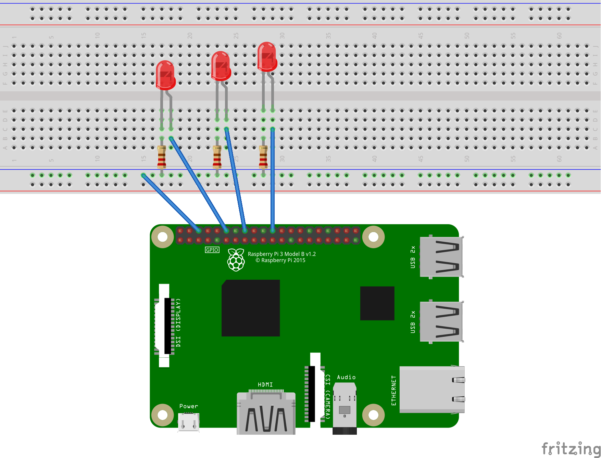

## Descrption

Query a weather API and light up an LED depending on the current conditions.

## Requirements

- Raspberry Pi & standard peripherals
- 4 Male to female jumper wires
- Red, Blue, and Green LEDs
- 3 Resistors
- Breadboard (optional)

## Rough steps

1. Create a python 3 virtual environment and install dependencies `pip install -r requirements.txt`
2. Try to get one diode to light. Take a look at the schematic for help.
3. Try to get all three diodes to light.
4. Create an AccuWeather API account and make a request for the current conditions of Omaha. Parse the response such that you can check if it's cloudy, raining, and sunny.
5. Light up each LED based off the info in 4.

## Challenges

- Accept user input for the city to display the weather for
- Support more weather types

## More Resources

- https://gpiozero.readthedocs.io/en/stable/index.html
- https://projects.raspberrypi.org/en/projects/physical-computing/

## Schematic

